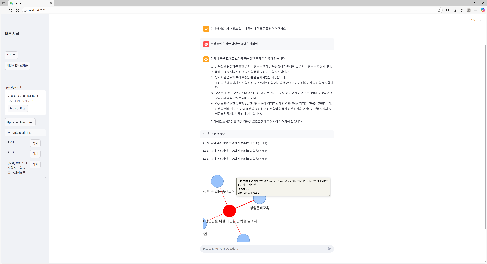

# Weather & Travel Bot — Real‑time Weather Planner + Document Search

> 실시간 날씨 기반 여행 일정 추천 챗봇과 할루시네이션 저감형 문서 검색 서비스
> 기간: 2024.02 – 2024.05 | Repo: github.com/fly4hyun/weather-travel-bot

---

## Summary

* 사용자 질문에서 **기간·위치 추출 → 기상청 API 호출 → 일정 추천**까지 자동화한 여행 플래너
* **FAISS 기반 문서 검색**으로 근거를 제시하고, **그래프 시각화**로 답변 신뢰성 검토 기능 제공
* **AI EXPO KOREA 2024** 시연

---

## Architecture

1. **NLU**: 질문에서 기간(날짜/범위)·위치(도시/행정구역) 엔터티 추출
2. **Weather Fetcher**: 기상청(API) 실시간/예보 데이터 호출 (기간·위치 기반)
3. **Planner**: 날씨/질문 의도/사용자 제약을 통합한 프롬프트로 일정 초안 생성
4. **Retriever**: FAISS로 문서 임베딩/검색 → 답변 근거 스니펫 수집
5. **Answerer**: 일정+근거 결합하여 응답 생성, **근거 그래프** 동시 출력

---

## Features

* **기간·위치 자동 추출** — 라벨 규칙+정규식+후처리로 안정성 확보
* **기상청 API 연동** — 현재/단기 예보 취합, 강수·기온·체감온도 반영 일정 추천
* **문서 검색(FAISS)** — 문서 벡터화, 질문 유사 문단 검색, **근거 인용** 표시
* **근거 시각화** — 응답에 사용된 데이터·문단을 그래프로 시각화하여 신뢰성 검토
* **일정 템플릿** — 시간대/활동/대안 시나리오(우천/폭염 등) 자동 생성

---

## My Contribution

* **기간·위치 추출 알고리즘** 설계/구현 (한국어 질의 전처리 규칙 세트)
* **기상청 API 연동 모듈** 및 요청 캐싱/재시도 로직 구현
* **FAISS 파이프라인**(토크나이즈→임베딩→인덱싱→검색) 구성 및 랭킹 후처리
* **근거 시각화 그래프** 생성 로직 구현 (응답 내부 사용 근거 노출)
* **데모 서비스** 전체 플로우 오케스트레이션 및 전시 시연 세팅

---

## Tech Stack

* **Retrieval**: FAISS, sentence/embedding model
* **Backend**: Python, FastAPI (or Streamlit 데모)
* **Data**: 기상청 API, 문서 코퍼스(사내/공개)
* **Infra**: Docker, 캐시(파일/메모리)

---

## Screenshots

### 근거 그래프 + 문서 검색 결과

  

---

## Notes on Disclosure

일부 문서 데이터와 키(기상청 API Key 등)는 비공개입니다. 구조·동작·지표 수준 설명은 가능합니다.
